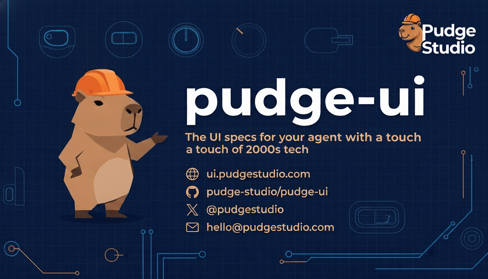

<p align="center">
  <a href="https://github.com/pudge-studio/pudge-ui/stargazers"></a>
  <a href="https://www.npmjs.com/package/@pudge-ui/mcp-server"></a>
  <a href="https://www.npmjs.com/package/@pudge-ui/mcp-server"></a>
  <a href="LICENSE"></a>
  <a href="https://ui.pudgestudio.com"></a>
</p>

A design system for 2000s-era consumer-electronics interfaces, written for coding agents.

> **Like what you see?** [⭐ Star pudge-ui on GitHub](https://github.com/pudge-studio/pudge-ui) — it helps coding agents and developers discover the project.

pudge-ui is a specification, not a component library. There's no package to install and no React components to import. Each component is a written spec — the physical part it imitates, how that part works, the exact CSS, and the rules that keep an implementation honest. You hand the spec to a coding agent, and it builds the component in whatever stack you're using: React Native, SwiftUI, Jetpack Compose, Flutter, or plain CSS.

Skeuomorphic detail doesn't fit in design tokens. `--color-primary: blue` can't describe the three-layer shadow of a raised rubber button or the lip shadow inside a recessed LCD. That needs prose — which is also what an LLM reads best.

Every component spec covers:

- **Physical analog** — the real 2000s hardware it mimics (Sony Walkman, Nikon dials, iPod click wheel, Nokia keypads, DJ consoles)
- **Mechanism** — how the part actually works (dome switches, rotary encoders, capacitive touch)
- **CSS recipe** — the exact CSS that reproduces the look
- **Constraints** — rules that rule out the "close but wrong" version

## Use it

1. Browse the components at [ui.pudgestudio.com](https://ui.pudgestudio.com).
2. Copy a component spec, or install the MCP server below.
3. Give it to your agent (Claude, GPT, Copilot, whatever) and describe what you're building.

## Quick start

### With MCP (Claude Code, Cursor, etc.)

Add to your MCP config:

```json
{
  "mcpServers": {
    "pudge-ui": {
      "command": "npx",
      "args": ["-y", "@pudge-ui/mcp-server"]
    }
  }
}
```

Then ask your agent: _"Build a music player interface using pudge-ui components"_

### Manual (any LLM)

1. Copy the [foundation spec](spec/foundation/)
2. Copy the [component spec(s)](spec/components/) you need
3. Paste into your LLM conversation
4. Describe what you want to build

## What's inside

### 93 components across 11 categories

| Category       | Components                                                               | Inspired by                                |
| -------------- | ------------------------------------------------------------------------ | ------------------------------------------ |
| **Buttons**    | Push, gel, rubber, clear, keypad, REC, function grid, icon, segmented    | Sony Alpha, iPod, Nokia, Gameboy           |
| **Toggles**    | Toggle, slide, rocker, power, DIP switch, LED checkbox, radio            | Camera switches, phone silent switch       |
| **Dials**      | Rotary encoder, mode dial, radial knob, cylindrical scroll, click wheel  | Nikon mode dial, DJ knobs, iPod wheel      |
| **Sliders**    | Volume, scrubber, fader, dual range, crossfader, stepper, vertical fader | Mixing console, DJ crossfader              |
| **Readouts**   | Signal display, camera readout, LCD, timecode, 7-segment, dot matrix     | Camera viewfinder, alarm clock, LED ticker |
| **Meters**     | Spectrum, VU, EQ, histogram, waveform, gauges, oscilloscope              | Audio equipment, camera histogram          |
| **Navigation** | Menu grid, list, tab bar, D-pad, rack panel, breadcrumbs, pagination     | Nokia menu, iPod list, Gameboy D-pad       |
| **Forms**      | Text input, textarea, search, select, color picker, file input           | Equipment LCD entry, TV color bars         |
| **Overlays**   | Panel, bezel, dialog, toast, focus brackets, grid overlay, tooltip       | Rack-mount panels, camera AF               |
| **Indicators** | Chips, badges, LEDs, spinners, skeleton, accordion, transport controls   | Panel LEDs, iPod transport                 |
| **Data**       | Data table, media grid, film strip                                       | Diagnostic readouts, contact sheets        |

### 6 material surfaces

Every component uses one of six physically-accurate material recipes:

1. **Brushed Metal** — iPod back plate, anodized aluminum
2. **Chrome** — Nikon dial rings, polished trim
3. **Rubber** — Gameboy buttons, soft-touch matte
4. **Glossy Polycarbonate** — iPod Nano case, gel buttons
5. **Glass** — iMac G3 clear shell, frosted plastic
6. **Phosphor Screen** — Camera viewfinder, VU meter display

## Project structure

```
spec/
  foundation/     design tokens, materials, depth model, naming
  components/     individual component specs
  compositions/   multi-component assembly specs
  guides/         extension guide, LLM usage guide, prompt templates
packages/
  mcp-server/     MCP server for agent integration
docs/             documentation site (ui.pudgestudio.com)
```

## Philosophy

1. **Physical analog commitment** — every CSS property maps to a real material or manufacturing process
2. **Warm neutral palette** — warm grays (`#1c1a18` not `#1c1c1c`) under tungsten workbench lighting
3. **Three-plane depth model** — every raised element uses a 3-layer shadow stack
4. **Material honesty** — rubber looks different from chrome looks different from glass

## Contributing

See [CONTRIBUTING.md](CONTRIBUTING.md) for guidelines.

## License & brand

Code and component specs are [MIT](LICENSE). The **pudge-ui** name, the **Pudge** capybara mascot,
and the logo are trademarks of Pudge Studio and are **not** covered by the MIT license — please
don't use them to imply endorsement or for a fork's branding.

## License

[MIT](LICENSE)
